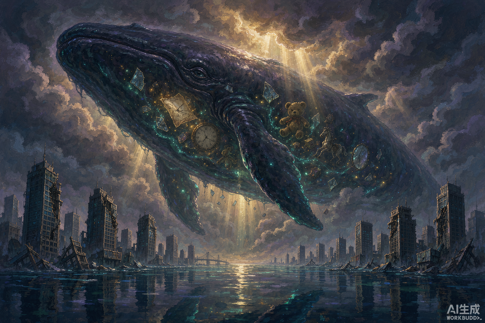
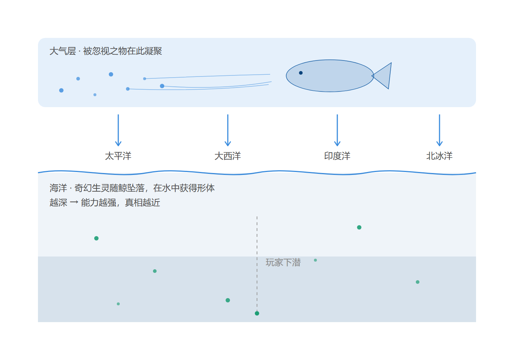
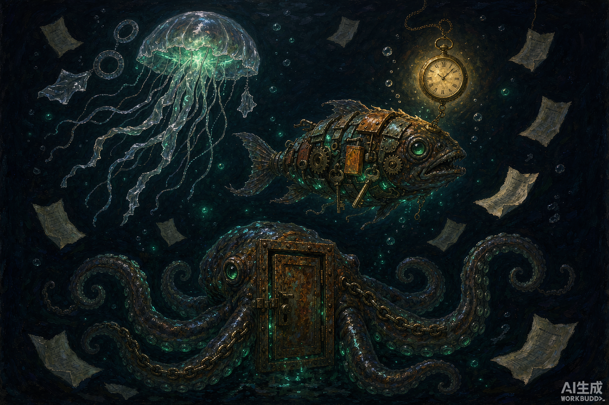
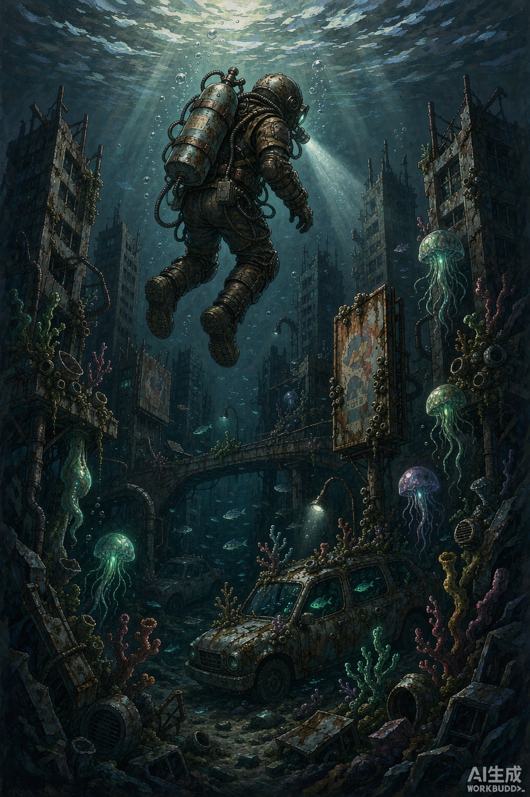

# 世界观设定 · 天鲸坠落

> ⚠️ **本文档已降级为「美术与氛围参考」，不再是设定来源。**
>
> 2026-09-29 团队拍板：剧情与玩法以 `Docs/Standards/鲸落之后_完整GDD_v1.0.md` 为唯一基准（决策 D1）。
> 本文中与 GDD 冲突的部分一律**以 GDD 为准**，具体冲突清单见 `narrative-design-framework.md` 第 6 节。
>
> **仍然有效的部分**：核心意象「反转的鲸落」的散文表达、色彩与视觉母题（遗骸感）、配图与氛围参考。
> **已作废的部分**：捕捉玩法、稀有度=被忽视程度、四大洋四章结构、打捞/留驻双结局。
>
> 保留此文档的目的是让美术与音频能读到「为什么这个世界的色调是这样的」。

---

> 原文（2026-09-22）：AbyssBloom 的核心世界观基线。玩法、美术、音频、数值主题均以此为纲。
> 本文档共配图 4 张，见文末「配图索引」。



---

## 一、一句话概括

被长久忽视的存在在大气层中凝聚成四头天鲸，自天穹坠落，把世界沉入海洋。
玩家潜入水下捕捉随鲸一起坠落的奇幻生灵，借它们的能力，一层层打捞起世界沉没的真相。

---

## 二、核心意象：反转的鲸落

现实中，鲸死后沉入海底。一具鲸尸可以供养一整套深海生态系统长达数十年 —— 它是死亡，也是给予。

本作把这个意象**掉了个头**：

| 现实中的鲸落 | AbyssBloom |
| --- | --- |
| 鲸从海面沉向海底 | 鲸从天空坠向海面 |
| 死亡，无人目睹 | 灾难，全球目击 |
| 供养一小片深海 | 供养整个世界 |
| 安静的终点 | 轰然的开端 |

**天鲸坠落既是毁灭，也是馈赠。** 淹没世界的那场灾难，同时把奇幻生灵撒遍了每一片海。
温柔与毁灭同体 —— 这就是「治愈 + 废土」的根。

---

## 三、设定根基：被忽视之物不会消失

世界观的第一性原理：**被忽视的存在不会消失，它们上升。**

被遗忘的、无人认领的、被搁置的东西，会缓慢升入大气层。它们在平流层之上聚集、缠绕、彼此凝结，越聚越大 —— 直到质量大到再也无法悬浮。

> 这里也是整个故事最锋利的地方：淹没世界的不是天灾，而是**人类自己的忽视**。
> 天鲸不是凶手，它们是世界积攒太久的、无人回应的东西，终于重到必须落下。

🔴 **待确认**：「被忽视」的确切所指 —— 见第十节。

---

## 四、事件：天鲸坠落（The Falling）



### 4.1 过程

1. **累积期**（数十年）—— 人类社会在高速运转中不断丢弃、搁置、忽略。大气层里的凝聚体悄然长大，无人察觉。
2. **显形期** —— 云层开始出现鲸形轮廓。人们把它当作奇观、当作气象异常、当作娱乐新闻。
3. **坠落期** —— 四头天鲸在相对集中的时间内，分别坠入四大洋。
4. **淹没期** —— 撞击与随之而来的海平面剧变吞没陆地。人类失去家园。
5. **静默期（游戏当下）** —— 世界是海。幸存者在水面与水下的残骸间求生。

### 4.2 喷发物的双重性

天鲸坠落时，从鲸身上散落的不只是血肉，还有**构成它们的全部存在**。
这些存在落入水中后获得形体，成为玩家要捕捉的「海洋奇幻生物」。

也就是说：**每一条鱼，都曾经是某样被忽视的东西。**

---

## 五、四大洋 · 四头天鲸 · 四个章节

四大洋天然把游戏切成四个章节，每一章对应一头天鲸、一种「被忽视」的形态、一套能力体系。

| 章节 | 海域 | 天鲸 | 被忽视的形态 | 环境气质 | 能力方向 |
| --- | --- | --- | --- | --- | --- |
| 第一章 | 太平洋 | 最沉的一头 | 被遗弃之物（旧玩具、停摆的钟、生锈的钥匙） | 最深、最黑、压力最大 | 深潜、发光、抗压 |
| 第二章 | 大西洋 | 最嘈杂的一头 | 未说出口的话（旧信、未接来电、走调的摇篮曲） | 洋流湍急、残骸密集 | 声呐、共鸣、回声定位 |
| 第三章 | 印度洋 | 最暖的一头 | 被遗忘的生灵（灭绝的物种、消失的方言） | 温暖、珊瑚繁盛、共生 | 共生、治愈、繁衍 |
| 第四章 | 北冰洋 | 最静的一头 | 被冻结的时间（停滞的等待、没兑现的约定） | 冰封、缓慢、封存 | 冻结、回溯、停滞 |

🔴 **待确认**：四章的主题映射与先后顺序由策划定稿。

**章节解锁逻辑**：每头天鲸沉在各自海域的海底最深处。玩家需要在前一章积累足够能力，才能下潜到下一头鲸的位置 —— 增量成长与章节推进天然咬合。

---

## 六、海洋奇幻生物



### 6.1 三种来源

| 来源 | 例 | 形体倾向 |
| --- | --- | --- |
| 被遗忘的**物** | 废弃的八音盒、断了线的风筝、没人再读的课本 | 机械残骸与生物组织的混合体 |
| 被遗忘的**情绪** | 没说出口的道歉、压下去的思念、咽回去的哭 | 半透明、发光、形状不稳定 |
| 被遗忘的**生灵** | 灭绝的渡渡鸟、消失的方言、拆掉的旧街 | 生物形态，但带着人造物的痕迹 |

### 6.2 视觉母题：**遗骸感**

每只生物身上都保留着「它曾经是什么」的证据：

- 一只水母的伞盖是一个透明的塑料袋
- 一条灯笼鱼的诱饵是一枚还在走动的怀表
- 一头大型生物的身体里嵌着半扇防盗门

**这既是奇幻，也是废土。** 玩家每次下潜，都在与人类世界的遗骸照面。

### 6.3 稀有度映射

| 稀有度 | 对应「被忽视」的程度 | 情感重量 |
| --- | --- | --- |
| 常见 | 刚被搁置不久，还带着体温 | 轻微遗憾 |
| 稀有 | 被遗忘了一代人 | 怀念 |
| 史诗 | 被整个时代跳过 | 惋惜 |
| 传说 | 从未被任何人真正看见过 | 悲伤 |
| 神话 | 天鲸自身的碎片 | 敬畏 |

---

## 七、能力系统与玩法咬合

### 7.1 核心循环

```
下潜 → 遭遇奇幻生物 → 捕捉 → 提取能力 → 能力叠加提升收益
  ↑                                              ↓
  └────────── 更深的海域 · 更强的生物 ←──────────┘
```

### 7.2 「获得他们的能力」的机制定位

捕捉生物后，玩家获得的是它的**特性**，不是它的数值。特性进入能力体系后与增量系统结合：

| 生物 | 提供的能力 | 实际作用 |
| --- | --- | --- |
| 灯笼鱼 | 深海照明 | 解锁更深海域的可视范围 |
| 电鳗 | 电场感知 | 显示附近稀有生物的位置 |
| 鹦鹉螺 | 抗压外壳 | 延长下潜时间上限 |
| 鲸类碎片 | 收益倍率 | 大幅提升整体产出 |

**设计意图**：能力成长不只是数字变大，而是**玩家能够抵达更远的地方**。探索范围本身就是奖励。

### 7.3 与增量的关系

- 在线：主动下潜捕捉，收益高，需要操作
- 离线：能力自动运作，收益低，用来保证回访
- 两者的结算必须共用同一套公式，避免数值漂移

---

## 八、叙事：真相的分层打捞



真相不是一个反转，而是**五层**，随下潜深度逐层剥开：

| 层 | 玩家以为 | 实际 |
| --- | --- | --- |
| 1 | 天鲸是自然灾害，我是幸存者 | 生物身上带着「人味」—— 一条鱼戴着婚戒 |
| 2 | 这些生物是鲸鱼的碎片 | 它们是人类的遗物 |
| 3 | 人类是无辜的受害者 | 天鲸是被人类的忽视养大的 |
| 4 | 真相：淹没世界的是人类自己 | —— |
| 5 | 那么，我要把世界捞回来吗？ | **终局抉择** |

### 终局的两个方向

| 结局 | 内容 | 情绪 |
| --- | --- | --- |
| **打捞** | 把水抽干，让陆地归来 —— 但被忽视之物将重新被忽视 | 温情，但残酷 |
| **留驻** | 让世界保持海洋，让所有被遗忘的存在得以存续 | 哀伤，但治愈 |

> 「治愈」不等于「圆满」。本作的治愈感来自**被看见**，而不是「一切恢复原样」。

---

## 九、与美术方向的呼应

| 关键词 | 落地方式 |
| --- | --- |
| **奇幻生物** | 生物组织的流畅感 + 人造遗物的硬边缘，两者缝合 |
| **治愈** | 柔和色温、缓慢摆动、生物发光、水下声音的低频包裹感 |
| **废土** | 锈蚀、剥落、藤壶与苔藓覆盖一切人造物；广告牌、车辆、楼房成为礁石 |

**色彩基调**：深渊的墨蓝 + 生物光的青绿 + 人造物残骸的锈橙。

---

## 十、待确认清单 🔴

1. **「被忽视的社会」具体指什么？** 目前的三种解读：
   - (a) 人类在快节奏中忽视了自己的情感与记忆 —— 天鲸是人类的眼泪，更私人、更治愈
   - (b) 被人类文明丢弃的物与生灵 —— 天鲸是万物的怨，偏向「文明的赎罪」
   - (c) 人类社会整体被某种力量忽视 —— 需要先定义「谁在忽视」，最冷峻也最宏大
   → **这一条决定全作的道德立场与结局基调。**
2. **玩家的身份**：普通幸存者？还是与天鲸有特殊关联的人？
3. **静默期已过多久**：淹没发生后第几年？决定废土的程度与 NPC 的存在形式。
4. **是否有其他的「人」**：NPC 幸存者、势力组织、还是完全孤独的独潜？
5. **叙事呈现方式**：图鉴文字？打捞物件的旁白？还是无文字的环境叙事？
6. **游戏名称的含义**：`AbyssBloom` 是「深渊中的绽放」—— 指生物在深渊中绽放，还是指被遗忘之物在深渊里重新生长？

---

## 配图索引

| 文件 | 内容 | 尺寸 |
| --- | --- | --- |
| `images/01-sky-whale-falling.png` | 天鲸坠落 —— 半透明的鲸体内含人类遗物，下方为淹没的城市 | 1536×1024 |
| `images/02-abyss-creatures.png` | 深渊奇幻生物 —— 塑料袋水母、怀表灯笼鱼、嵌着防盗门的章鱼 | 1536×1024 |
| `images/03-player-diving.png` | 玩家下潜 —— 从水面潜入深渊，深处是沉没的城市 | 1024×1536 |
| `images/04-vertical-narrative.png` | 天鲸坠落垂直叙事剖面（信息图） | 1408×988 |

> 前三张为 AI 生成的概念示意图，用于统一美术方向与氛围参考；正式美术资源请以本设定为准另行制作，源文件置于 `ArtSource/Reference/`。
